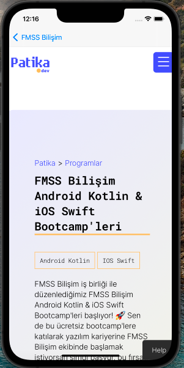

# Patika Bootcamp News

The application lists the bootcamps in patika.dev as a concept and directs them to the relevant link, allowing them to open in webview.

### Application Icon

 

### Launch Screen

 
 
 
### Home Screen (Bootcamps)
 

### Detail Screen

### WebView Screen
 

